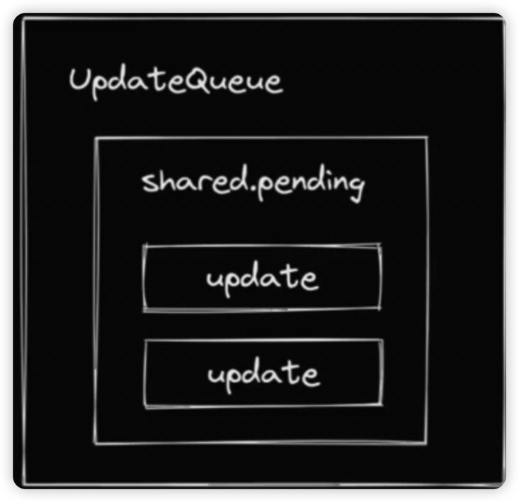
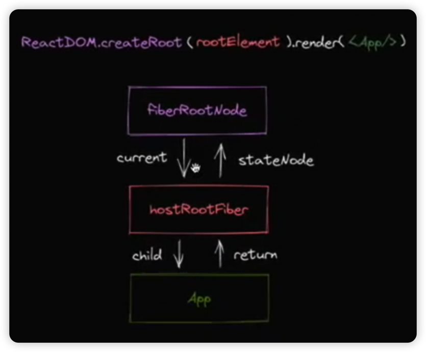

# reconciler

## React三种基础的节点类型

- React Element 即createElement方法的返回值
- React Component 开发者可以在React中定义的组件，有函数式和class类型
- FiberNode 组成Fiber架构的节点类型

## 双缓存机制

将数据保存在缓存区再替换的技术称为双缓存。

个人理解：
因为React 的优先级机制，渲染并不一定会发生在虚拟DOM构建完成之后，即在构建的过程中就会发生渲染逻辑。有了双缓存，在一次虚拟DOM未构建完成之前发生的渲染可以使用之前的DOM树，
从而避免导致用户看到**闪烁，不完全**的页面结构一部分一部分的显示出来。

## reconciler的工作方式

对于同一个节点，比较其ReactElement与 fiberNode. 生成子fiberNode。井根据比较的结果生成不同标记（插入、删除、移动…），对应不同宿主环境APl的执行。

比如挂载 `<div></div>`

```js
// React Element <div></div>
jsx('div');
// 对应的fiberNode
null;
// 生成子fiberNode
// 对应标记
Placement;
```

将`<div></div>`更新为`<p></p>`:

```js
// React Element <p></p>
jsx("p")
// 对应的fiberNode
FiberNode {type: 'div'}
// 生成子fiberNode
// 对应标记
Deletion Placement
```

当所有React Element比t较完后，会生成一棵`fiberNode`树，一共会存在两棵`fiberNode`树：

1. current：与视图中真实Ul对应的fiberNode树
2. workInProgress：触发更新后，正在reconciler中计算的fiberNode树

## JSX消费的顺序

### DFS 深度优先遍历与 BFS 广度优先遍历详解

以DFS（深度优先遍历）的顺序遍历`React Element`，这意味着：

1. 如果有子节点，遍历子节点
2. 如果没有子节点，遍历兄弟节点
   例子：

```jsx
<Card>
	<h3>你好</h3>
	<p>p</p>
</Card>
```

这是个递归的过程，存在递、归两个阶段：

1. 递：对应beginWork
2. 归：对应completeWork

## 更新

常见的触发更新的方式：

- ReactDOM.createRoot().render（或老版的ReactDOM.render)
- this.setState
- useState的dispatch方法
  我们希望实现一套统一的更新机制，他的特点是：
- 兼容上述触发更新的方式
- 方便后续扩展（优先级机制..）

### 更新机制的组成部分

- 代表更新的数据结构 -- update
- 代表消费的数据结构 -- updateQueue



接下来要做的工作：

- 实现mount时调用的API
- 将API接入更新机制

需要考虑的事情:

- 更新可能发生于任意组件，而更新的流程是从根节点递归的
- 需要一个统一的根节点保存通用信息



## mount更新流程

目的：

- 生成workInProgress fiberNode树
- 标记副作用flags

更新流程的步骤:

- 递 beginWork
- 归 completeWork

### beginWork

对于如下结构的reactElement:

```jsx
<A>
	<B>你好</B>
</A>
```

当进入A的beginWork时，通过对比B的current fiberNode 与B的 reactElement 生成B对应的workInProgress fiberNode。

在此过程中最多会标记2类与**结构变化**相关的flags:

- Placement
  插入：a -> ab 移动: abc -> bca
- ChildDeletion
  删除: ul>li*3 -> ul>li*1

此过程不包含于属性变化相关的flag:

- Update

```jsx
 -> 
```

### 实现与Host相关节点的beginWork

首先，为开发环境增加**DEV**标记, 方便Dev包打印更多信息:

```sh
pnpm i -d -w @rollup/plugin-replace
```

`HostRoot`的`beginWork`工作流程：

1. 计算状态的最新值
2. 创建子fiberNode

`HostComponent`的beginWork工作流程:

1. 创建子fiberNode

`HostText`没有beginWork工作流程（因为`HostText`没有子节点）。如
`<p> 唱跳Rap </p>`

#### beginWork性能优化策略

考虑如下结构的reactElement:

```html
<div>
	<p>练习时长</p>
	<span>两年半</span>
</div>
```

理论上mount流程完毕后包含的flags:

- 两年半 Placement
- span Placement
- 练习时长 Placement
- P Placement
- div Placement

相较于执行5次Placement，我们可以构建好**离屏DOM树**后，对div执行1次Placement操作。

## completeWork

需要解决的问题:

- 对于Host类型的fiberNode: 构建离屏DOM树
- 标记Update flag (TODO)

## completeWork性能优化策略

flags分布在不同的fiberNode中，如何快速找到他们？
答案： 利用completeWork向上遍历(归)的流程，将子fiberNode 的flags 冒泡到父fiberNode;

## 第六课 初探ReactDOM

react 内部分为三个阶段

- schedule阶段
- render阶段 (beginWork completeWork)
- commit 阶段 （commitWork）
  - beforeMutation 阶段
  - mutation阶段
  - layout阶段

当前commit阶段要执行的任务

1. fiber树的切换
2. 执行Placement对应的操作

需要注意的问题是：
考虑如下jsx,如果span 含有flag,该如何找到它：

```jsx
<App>
	<div>
		<span>这是文字内容</span>
	</div>
</App>
```

## 7. 初探FC与实现

Function Component 需要考虑的问题:

- 如何支持FC
- 如何组织Hooks

### 如何支持FC

FC的工作同样植根于

- beginWork
- completeWork

## 8. 实现useState

hook脱离FC上下文就是普通函数。如果让他拥有感知上下文环境的能力?

比如说：

- hook如何知道在宁一个hook的上下文环境内执行

  ```jsx
  function App() {
  	useEffect(() => {
  		useState(0);
  	});
  }
  ```

- hook怎么知道当前是mount还是update？

解决方案：
在不同上下文中调用的hook不是同一个函数

## 初探Update流程

### update与mount的区别

对于beginWork:

- 需要处理childDeletion的情况
- 需要处理节点移动的情况 (abc-bca)

对于completeWork:

- 需要处理HostText内容更新的情况
- 需要处理HostComponent属性变化的情况

对于commitWork:

- 对于ChildDeletion, 需要遍历被删除的子树
- 对于useState, 需要实现相对于mountState的updateState

### beginWork流程

处理流程：

1. 比较是否可以复用current Fiber
   a. 比较key, 如果key不同，不能复用
   b. 比较type, 如果type不同，不能复用
   c. 如果key和type 都相同，则可复用
2. 不能复用，则创建新的fiberNode。

注意: **对于同一个fiberNode,即使反复更新，current和workInProgress这两个fiber树也会重复使用**

### completeWork流程

主要处理标记Update的情况

### commitWork流程

对于标记ChildDeletion的子树，由于子树中:

- 对于FC，需要处理useEffect unmount执行、解绑ref
- 对于HostComponent, 需要解绑ref
- 对于子树的 根HostComponent, 需要解绑ref.
